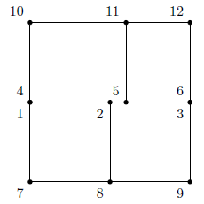

# Mortar2D.jl

[](https://travis-ci.org/JuliaFEM/Mortar2D.jl)[](https://coveralls.io/github/JuliaFEM/Mortar2D.jl?branch=master)[](https://juliafem.github.io/Mortar2D.jl/stable)[](https://juliafem.github.io/Mortar2D.jl/latest)[](https://github.com/JuliaFEM/Mortar2D.jl/issues)

Mortar2D.jl is a Julia package to calculate discrete projections between
non-conforming finite element mesheds. The resulting "mortar matrices" can
be used to tie non-conforming finite element meshes together which are meshed
separately to construct bigger models.

Using mortar methods in mesh tie problems results variationally consistent
solution. Mathematically, goal is to solve mixed problem with primary field
variable and Lagrange multipliers, which have a physical meaning (e.g. contact
pressure if unknown field is displacement). The problem arising is a typical
saddle point problem with zeros on diagonal.

## Installing and testing package

Installing package goes same way like other packages in julia, i.e.
```julia
julia> Pkg.add("Mortar2D")
```

Testing package can be done using `Pkg.test`, i.e.
```julia
julia> Pkg.test("Mortar2D")
```

Probably the easiest way to test the functionality of package is to
use [JuliaBox](https://juliabox.com/).

## Usage example

Let us calculate projection matrices D and M for the following problem:



Problem setup:

```julia
Xs = Dict(1 => [0.0, 1.0], 2 => [5/4, 1.0], 3 => [2.0, 1.0])
Xm = Dict(4 => [0.0, 1.0], 5 => [1.0, 1.0], 6 => [2.0, 1.0])
coords = merge(Xm , Xs)
Es = Dict(1 => [1, 2], 2 => [2, 3])
Em = Dict(3 => [4, 5], 4 => [5, 6])
elements = merge(Es, Em)
element_types = Dict(1 => :Seg2, 2 => :Seg2, 3 => :Seg2, 4 => :Seg2)
slave_element_ids = [1, 2]
master_element_ids = [3, 4]
```

Calculate projection matrices D and M

```julia
s, m, D, M = calculate_mortar_assembly(
    elements, element_types, coords,
    slave_element_ids, master_element_ids)
```

According to theory, the interface should transfer constant without any
error. Let's test that:

```julia
u_m = ones(3)
u_s = D[s,s] \ (M[s,m]*um)

# output

3-element Array{Float64,1}:
 1.0
 1.0
 1.0
```

The rest of the story can be read from the [documentation](https://juliafem.github.io/Mortar2D.jl/latest/).
There's also brief review to the theory behind non-conforming finite element meshes.
