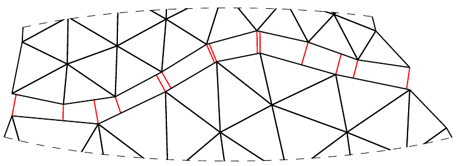

# Mortar2D.jl documentation


```@contents
Pages = ["index.md", "api.md"]
```

Mortar2D.jl is a julia package to calculate discrete projections between
non-conforming finite element mesheds. The resulting "mortar matrices" can
be used to tie non-conforming finite element meshes together which are meshed
separately to construct bigger models.

Using mortar methods in mesh tie problems results variationally consistent
solution. Mathematically, goal is to solve mixed problem with primary field
variable and Lagrange multipliers, which have a physical meaning (e.g. contact
pressure if unknown field is displacement). The problem arising is a typical
saddle point problem with zeros on diagonal.

Mortar2D.jl is part of JuliaFEM. All codes are MIT licensed.


## Installing and testing package

Installing package goes same way like other packages in julia, i.e.
```julia
julia> Pkg.add("Mortar2D")
```

Testing package can be done using `Pkg.test`, i.e.
```julia
julia> Pkg.test("Mortar2D")
```

## Contributing

Have a new great idea and want to share it with the open source community?
From [here](https://github.com/JuliaLang/julia/blob/master/CONTRIBUTING.md)
and [here](https://juliadocs.github.io/Documenter.jl/stable/man/contributing/)
you can look for coding style. [Here](https://docs.julialang.org/en/stable/manual/packages/#Making-changes-to-an-existing-package-1) is explained how to contribute to
open source project, in general.

