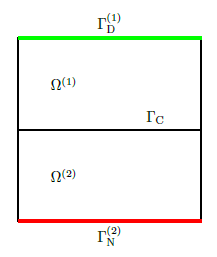

# Theory

Let us consider the simple following simple Laplace problem in the
domain ``\Omega=\left\{ \left(x,y\right)\in\mathbb{R}^{2}|0\leq x,y\leq2\right\}``.



The strong form of the problem is 
```math
\begin{align}
-\Delta u^{\left(i\right)} & =0\qquad\text{in }\Omega^{\left(i\right)},i=1,2\\
u^{\left(1\right)} & =0\qquad\text{on }\Gamma_{\mathrm{D}}^{\left(1\right)}\\
u^{\left(1\right)}-u^{\left(2\right)} & =0\qquad\text{on }\Gamma_{\mathrm{C}}\\
\frac{\partial u^{\left(2\right)}}{\partial n} & =g\qquad\text{on }\Gamma_{\mathrm{N}}^{\left(2\right)}
\end{align}
```

Corresponding weak form of the problem is to find ``u^{\left(i\right)}\in\mathcal{U}$
and $\lambda\in\mathcal{M}`` such that
```math
\begin{align}
\int_{\Omega}\nabla u\cdot\nabla v\,\mathrm{d}x+\int_{\Gamma_{\mathrm{C}}}\lambda\left(v^{\left(1\right)}-v^{\left(2\right)}\right)\,\mathrm{d}s & =\int_{\Omega}fv\,\mathrm{d}x+\int_{\Gamma_{\mathrm{N}}}gv\,\mathrm{d}s &  & \forall v^{\left(i\right)}\in\mathcal{V}^{\left(i\right)}\\
\int_{\Gamma_{\mathrm{C}}}\mu\left(u^{\left(1\right)}-u^{\left(2\right)}\right)\,\mathrm{d}s & =0 &  & \forall\mu\in\mathcal{M}
\end{align}
```

In more general form is to find ``u^{\left(i\right)}\in\mathcal{U}``
and ``\lambda\in\mathcal{M}`` such that
```math
\begin{align}
a\left(u^{\left(i\right)},v^{\left(i\right)}\right)+b\left(\lambda,v^{\left(i\right)}\right) & =0\qquad\forall v^{\left(i\right)}\in\mathcal{V}^{\left(i\right)}\\
b\left(\mu,u^{\left(i\right)}\right) & =0\qquad\forall\mu\in\mathcal{M}
\end{align},
```
where
```math
\begin{align}
b\left(\lambda,v^{\left(i\right)}\right) & =\int_{\Gamma_{\mathrm{C}}}\lambda\left(v^{\left(1\right)}-v^{\left(2\right)}\right)\,\mathrm{d}s\\
b\left(\mu,u^{\left(i\right)}\right) & =\int_{\Gamma_{\mathrm{C}}}\mu\left(u^{\left(1\right)}-u^{\left(2\right)}\right)\,\mathrm{d}s
\end{align}
```

After substituting interpolation polynomials to weak form we get so called mortar matrices ``\boldsymbol{D}`` and ``\boldsymbol{M}``:
```math
\begin{align}
\boldsymbol{D}\left[j,k\right] & =\int_{\Gamma_{\mathrm{c}}^{\left(1\right)}}N_{j}N_{k}^{\left(1\right)}\,\mathrm{d}s,\\
\boldsymbol{M}\left[j,l\right] & =\int_{\Gamma_{\mathrm{c}}^{\left(1\right)}}N_{j}\left(N_{l}^{\left(2\right)}\circ\chi\right)\,\mathrm{d}s,
\end{align}
```
where ``\chi`` is mapping between contacting surfaces. Let us define some contact pair:

```@example 0
coords = Dict(1 => [8.0, 10.0],
              2 => [7.0, 7.0],
              3 => [4.0, 3.0],
              4 => [0.0, 0.0],
              5 => [-3.0, 0.0],
              6 => [12.0, 10.0],
              7 => [10.0, 4.0],
              8 => [7.0, 2.0],
              9 => [4.0, -2.0],
              10 => [0.0, -3.0],
              11 => [-4.0, -3.0])

elements = Dict(
    1 => [1, 2],
    2 => [2, 3],
    3 => [3, 4],
    4 => [4, 5],
    5 => [6, 7],
    6 => [7, 8],
    7 => [8, 9],
    8 => [9, 10],
    9 => [10, 11])

slave_element_ids = [1, 2, 3, 4]

slave_elements = Dict(i => elements[i] for i in slave_element_ids)

master_element_ids = [5, 6, 7, 8, 9]

element_types = Dict(i => :Seg2 for i=1:length(elements));
```

```@example 0
using PyPlot # hide
include("plots.jl") # hide
plot1(plot_element_normals=true) # hide
savefig("fig1.svg"); nothing # hide
```


For first order elements, normal direction is not unique. For that reason some preprocessing needs to be done to calculate unique nodal normals.

Unique nodal normals can be calculated several different ways, more or less sophisticated. An easy solution is just to take average of the normals of adjacing elements connecting to node ``k``, i.e.
```math
\begin{equation}
\boldsymbol{n}_{k}=\frac{\sum_{e=1}^{n_{k}^{\mathrm{adj}}}\boldsymbol{n}_{k}^{\left(e\right)}}{\left\Vert \sum_{e=1}^{n_{k}^{\mathrm{adj}}}\boldsymbol{n}_{k}^{\left(e\right)}\right\Vert },
\end{equation}
```
where ``\boldsymbol{n}_{k}^{\left(e\right)}`` means the normal calculated
in element ``e`` in node ``k``, and adj means adjacing elements.

This is implemented in function `calculate_normals`:

```@example 0
plot1(;plot_nodal_normals=true) # hide
savefig("fig2.svg"); nothing # hide
normals = calculate_normals(slave_elements, element_types, coords)
```


This package follows the idea of continuous normal field, proposed by Yang et al., where all the quantities are projected using only slave side normals.
If we wish to find the projection of a slave node ``\boldsymbol{x}_{\mathrm{s}}``,
having normal vector ``\boldsymbol{n}_{\mathrm{s}}`` onto a master
element with nodes ``\boldsymbol{x}_{\mathrm{m1}}`` and ``\boldsymbol{x}_{\mathrm{m2}}``,
we are solving ``\xi^{\left(2\right)}`` from the equation 
```math
\begin{equation}
\left[N_{1}\left(\xi^{\left(2\right)}\right)\boldsymbol{x}_{\mathrm{m1}}+N_{2}\left(\xi^{\left(2\right)}\right)\boldsymbol{x}_{\mathrm{m2}}-\boldsymbol{x}_{\mathrm{s}}\right]\times\boldsymbol{n}_{\mathrm{s}}=\boldsymbol{0}.
\end{equation}
```

The equation to find the projection of a master node ``\boldsymbol{x}_{\mathrm{m}}``
onto a slave element with nodes ``\boldsymbol{x}_{\mathrm{s1}}`` and
``\boldsymbol{x}_{\mathrm{s2}}`` and normals ``\boldsymbol{n}_{\mathrm{s1}}``
and ``\boldsymbol{n}_{\mathrm{s1}}`` is 
```math
\begin{equation}
\left[N_{1}\left(\xi^{\left(1\right)}\right)\boldsymbol{x}_{\mathrm{s1}}+N_{2}\left(\xi^{\left(1\right)}\right)\boldsymbol{x}_{\mathrm{s2}}-\boldsymbol{x}_{\mathrm{m}}\right]\times\left[N_{1}\left(\xi^{\left(1\right)}\right)\boldsymbol{n}_{s1}+N_{2}\left(\xi^{\left(1\right)}\right)\boldsymbol{n}_{\mathrm{s2}}\right]=\boldsymbol{0},
\end{equation}
```
where ``\xi^{\left(1\right)}`` is the unknown parameter. First equation
is linear and second is quadratic (in general). Second equation is
also linear if ``\boldsymbol{n}_{\mathrm{s1}}=\boldsymbol{n}_{\mathrm{s2}}``.

These equations are solved in function `project_from_master_to_slave` and `project_from_slave_to_master`. They are used in function `calculate_segments`, which is used to calculate segmentation of interface.

```@example 0
plot1(;plot_segmentation=true) # hide
savefig("fig3.svg"); nothing # hide
segmentation = calculate_segments(slave_element_ids, master_element_ids,
                                  elements, element_types, coords, normals)

```


After segmentation is calculated, it's possible to integrate over
non-conforming surface to calculate mortar matrices ``\boldsymbol{D}``
and ``\boldsymbol{M}`` or ``\boldsymbol{P}=\boldsymbol{D}^{-1}\boldsymbol{M}``. 
Calculation projection matrix ``\boldsymbol{P}`` is implemented as function `calculate_mortar_assembly`:

```@example 0
s, m, D, M = calculate_mortar_assembly(elements, element_types, coords,
                                       slave_element_ids, master_element_ids)
```

This last command combines everything above to single command to calculate
projection matrix needed for finite element codes.

# References

- Wikipedia contributors. "Mortar methods." Wikipedia, The Free Encyclopedia. Wikipedia, The Free Encyclopedia.
- Maday, Yvon, Cathy Mavriplis, and Anthony Patera. "Nonconforming mortar element methods: Application to spectral discretizations." (1988).
- Yang, Bin, Tod A. Laursen, and Xiaonong Meng. "Two dimensional mortar contact methods for large deformation frictional sliding." International journal for numerical methods in engineering 62.9 (2005): 1183-1225.
- Yang, Bin, and Tod A. Laursen. "A contact searching algorithm including bounding volume trees applied to finite sliding mortar formulations." Computational Mechanics 41.2 (2008): 189-205.
- Wohlmuth, Barbara I. "A mortar finite element method using dual spaces for the Lagrange multiplier." SIAM journal on numerical analysis 38.3 (2000): 989-1012.
